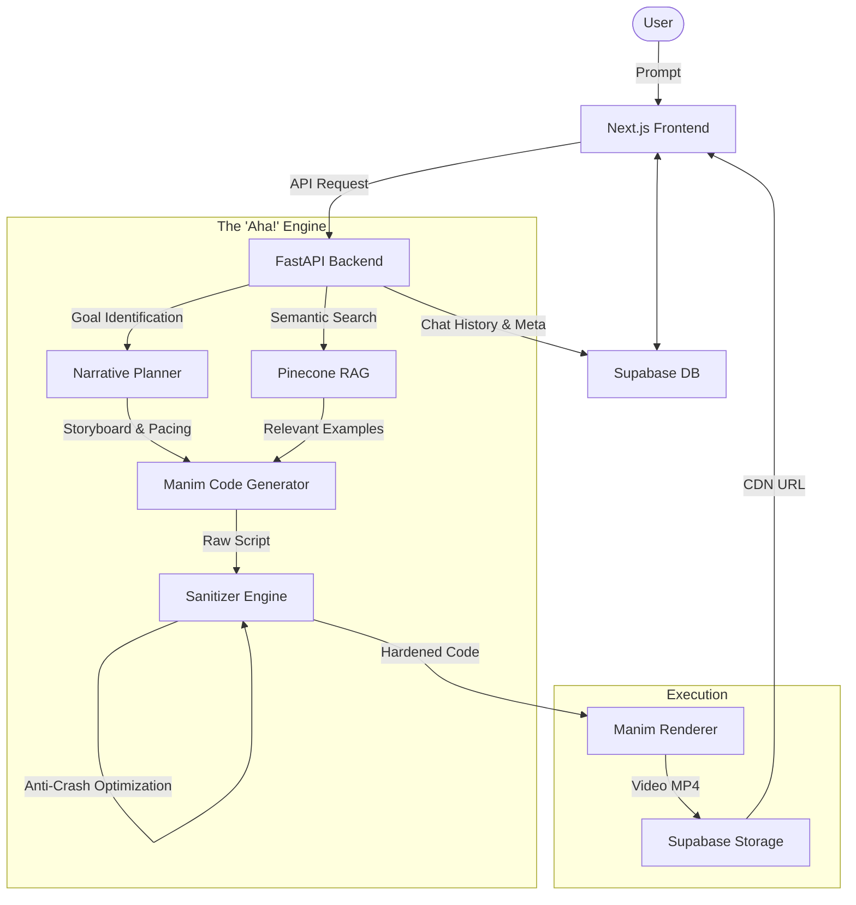

<div align="center">
  

  # 🎬 MovingLines
  
  **The ultimate "Aha!" moment generator. Transform complex math into cinematic 3Blue1Brown-style animations.**
  
  [](https://nextjs.org/)
  [](https://fastapi.tiangolo.com/)
  [](https://www.manim.community/)
  [](https://deepmind.google/technologies/gemini/)

  MovingLines isn't just a code generator; it's a **Narrative Designer**. It uses an agentic workflow to storyboard, plan, and render mathematically beautiful animations that prioritize visual continuity and educational clarity.
</div>

---

## 🏛️ System Architecture

MovingLines employs a multi-agent "Phased Generation" strategy to ensure high-quality output.



---

## 🎨 3B1B Style Principles (Injected in Every Script)

Our AI Agent follows strict cinematic guidelines inspired by Grant Sanderson's work:

- 🌊 **Progressive Revelation**: Content is built step-by-step; never dumped all at once.
- 🔄 **Visual Continuity**: Objects morph (`ReplacementTransform`) rather than just fading out.
- 🧘 **Breathing Room**: Automatic `self.wait(2)` inserted after major realizations.
- 🧼 **Clean Canvas Policy**: Screens are proactively cleared to prevent visual clutter and text overlaps.
- 📏 **Legibility**: Large fonts, high-contrast colors, and "safe zone" centering for mobile-friendly viewing.

---

## 🛠️ Tech Stack

### Frontend
- **Framework**: Next.js 16 (App Router)
- **State**: React Server Components & Streaming
- **Animations**: Framer Motion
- **Database Access**: Drizzle ORM

### Backend
- **Framework**: FastAPI
- **Mathematics**: Manim Community Edition
- **Intelligence**: Google Gemini 1.5 Pro (via LangChain)
- **Memory**: Pinecone Vector DB (RAG)
- **Real-time**: Socket.IO for live rendering status

---

## 🚀 Quick Start

### 🐳 Docker Deployment
```bash
# 1. Configure environment
cp env.example .env

# 2. Build and run
docker-compose up --build
```

### 💻 Local Development

#### Backend
```bash
cd backend
python -m venv venv
source venv/bin/activate
pip install -r requirements.txt
python -m uvicorn app.main:app --reload
```

#### Frontend
```bash
cd frontend
bun install
bun run dev
```

---

## 🧠 The Sanitization Engine

One of the core strengths of MovingLines is its **Anti-Crash Layer**. It automatically detects and fixes:
- ✅ **Vector-Scalar Mismatches**: halluncinated `set_x(RIGHT)` calls.
- ✅ **API Hallucinations**: invalid parameters like `at_arg` or legacy `add_tip` syntax.
- ✅ **Indentation Shifts**: Ensures AI-generated code never triggers Python syntax errors.
- ✅ **Missing Imports**: Auto-injects common Manim components if forgotten by the LLM.

---

## 🤝 Contributing

We welcome contributions to the Narrative Planner or additional Manim examples for our RAG database! 

1. Fork the repo.
2. Create your branch (`feature/AmazingFeature`).
3. Push and open a PR.

---
<div align="center">
  Made with ❤️ for the Math & Motion Community
</div>
