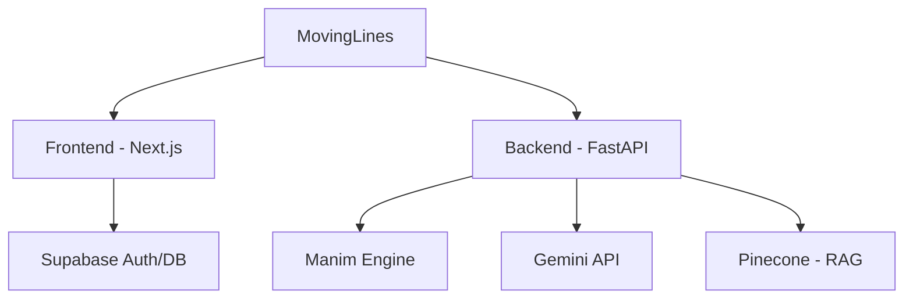

<div align="center">
  

  # 🎬 MovingLines
  
  **The ultimate AI-powered Manim animation generator.**
  
  [](https://nextjs.org/)
  [](https://fastapi.tiangolo.com/)
  [](https://www.manim.community/)
  [](https://aistudio.google.com/)
  [](https://opensource.org/licenses/MIT)

  MovingLines transforms your text prompts into beautiful, mathematical animations using Manim and Google Gemini. Experience the power of RAG-enhanced animation scripts.
</div>

---

## ✨ Features

- 🧠 **AI-Powered Scripting**: Leverages Google Gemini 1.5 Pro to write precise Manim code.
- 📚 **RAG Integration**: Optimized with Pinecone vector database for high-quality Manim examples.
- ⚡ **Real-time Generation**: Watch your animations come to life with a modern, responsive UI.
- 🎥 **Quality Controls**: Choose from 480p up to 4K cinematic quality.
- ☁️ **Cloud Storage**: Seamlessly sync your animations with Supabase.
- 🐳 **Docker Ready**: Easy deployment with containerized services.

---

## 🛠️ Tech Stack

### Frontend
- **Framework**: [Next.js 15](https://nextjs.org/) (App Router)
- **Styling**: [Tailwind CSS](https://tailwindcss.com/) & [Framer Motion](https://www.framer.com/motion/)
- **ORM**: [Drizzle ORM](https://orm.drizzle.team/)
- **Auth & Storage**: [Supabase](https://supabase.com/)

### Backend
- **API Framework**: [FastAPI](https://fastapi.tiangolo.com/)
- **Engine**: [Manim Community Edition](https://www.manim.community/)
- **AI Orchestration**: [LangChain](https://www.langchain.com/)
- **Vector DB**: [Pinecone](https://www.pinecone.io/) (via RAG)

---

## � Quick Start

### 🐳 Option 1: Docker (Easiest)

1. **Clone & Enter**:
   ```bash
   git clone https://github.com/piyushdhoka/movinglines.git
   cd movinglines
   ```

2. **Configure Environment**:
   ```bash
   cp env.example .env
   # Edit .env with your API keys
   ```

3. **Launch**:
   ```bash
   docker-compose up --build
   ```

---

### � Option 2: Manual Setup (Development)

#### Prerequisites
- Python 3.10+
- Node.js 18+
- [FFmpeg](https://ffmpeg.org/download.html) (Required for Manim)

#### 1. Backend Setup
```bash
cd backend
python -m venv venv
source venv/bin/activate # Windows: .\venv\Scripts\activate
pip install -r requirements.txt
cp .env.example .env
# Seed Pinecone
python -m scripts.seed_pinecone
```

#### 2. Frontend Setup
```bash
cd frontend
npm install
cp .env.example .env.local
# Run migrations
npm run db:migrate
```

#### 3. Run Development Servers
- **Backend**: `python -m uvicorn app.main:app --reload --port 8000`
- **Frontend**: `npm run dev`

---

## 📂 Project Structure



```text
movinglines/
├── backend/            # FastAPI, Manim logic, AI prompts
├── frontend/           # Next.js UI, Drizzle schema, Supabase client
├── docker-compose.yml  # Orchestration
└── README.md           # This file
```

---

## 🎬 Video Quality Options

| Quality | Resolution | FPS | Best For |
|---------|------------|-----|----------|
| `l` | 480p | 15 | Quick Previews |
| `m` | 720p | 30 | Standard Sharing |
| `h` | 1080p | 60 | High Definition |
| `k` | 4K | 60 | Cinematic Output |

---

## 🤝 Contributing

Contributions make the open source community such an amazing place to learn, inspire, and create. Any contributions you make are **greatly appreciated**.

1. Fork the Project
2. Create your Feature Branch (`git checkout -b feature/AmazingFeature`)
3. Commit your Changes (`git commit -m 'Add some AmazingFeature'`)
4. Push to the Branch (`git push origin feature/AmazingFeature`)
5. Open a Pull Request

---

## 📄 License

Distributed under the MIT License. See `LICENSE` for more information.

---

## � Star History

[](https://www.star-history.com/#piyushdhoka/movinglines&type=date&legend=top-left)

<div align="center">
  Made with ❤️ by Piyush Dhoka
</div>
