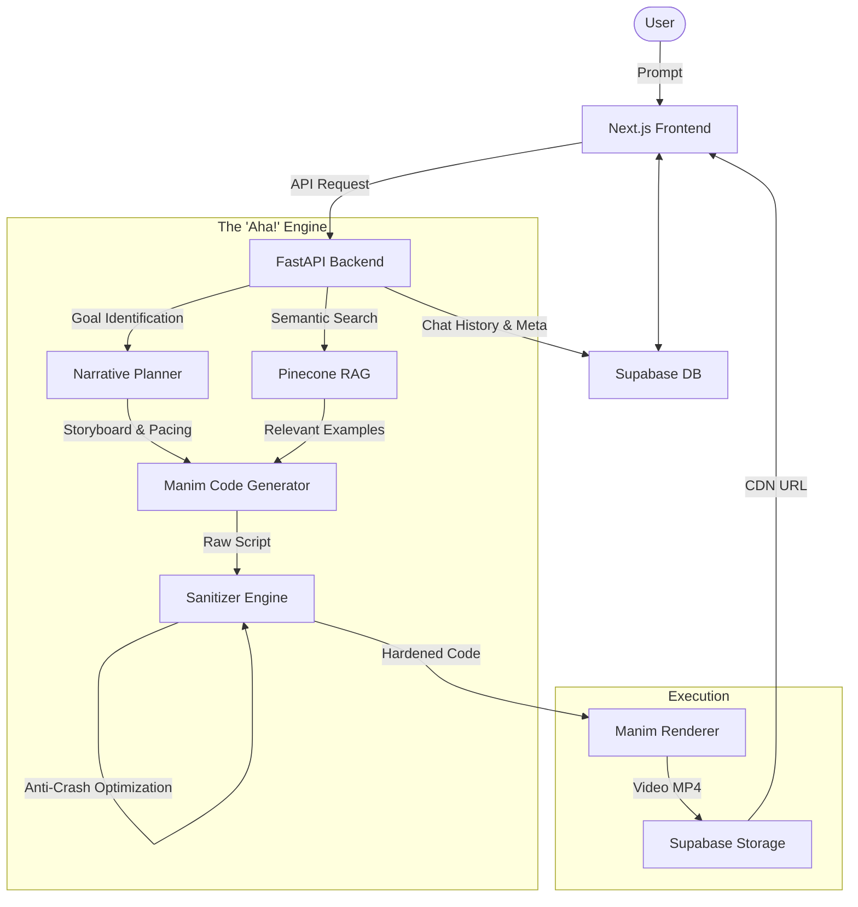

import { Icon } from '@/components/Icon';

# <Icon name="Layout" className="inline-block mr-2" /> System Architecture

MovingLines is built on a modern, decoupled architecture designed for high performance and reliability. It coordinates multiple AI agents and rendering engines to transform text into video.

## High-Level Flow

The following diagram illustrates how your prompt travels through the system:

## 1. Frontend: Next.js & Framer Motion
The frontend is a **Next.js 16** application that provides a responsive, low-latency interface.
- **Real-time Status**: We use **Socket.IO** to stream rendering logs and progress bars directly from the backend to the UI.
- **Auth & Database**: Integration with **Supabase** handles secure user authentication and persistent chat history.

## 2. Backend: FastAPI Orchestration
The backend is powered by **FastAPI** (Python), chosen for its asynchronous capabilities and native support for Python-based AI tools.
- **Task Queue**: Each animation request is processed as an asynchronous task to prevent blocking the main thread.
- **Credit System**: A basic credit-based usage system is integrated via Supabase RPCs.

## 3. The AI Engine (Agentic Workflow)
Instead of a single "one-shot" prompt, MovingLines uses a phased pipeline:
1. **Planner Agent**: Analyzes the topic and creates a 3b1b-style storyboard.
2. **RAG Layer**: Injects relevant coding examples from Pinecone into the generator's context.
3. **Generator Agent**: Writes the actual Manim code based on the storyboard and RAG context.
4. **Sanitizer Engine**: Automatically scans the code for common LLM hallucinations and fixes them.

## 4. Rendering: Manim Community Edition
The actual rendering happens in a dedicated Manim environment.
- **Dockerized**: The renderer can be run inside a Docker container to ensure consistent environment variables and libraries.
- **FFmpeg Integration**: Handles the encoding of mathematical frames into high-quality MP4 files.
